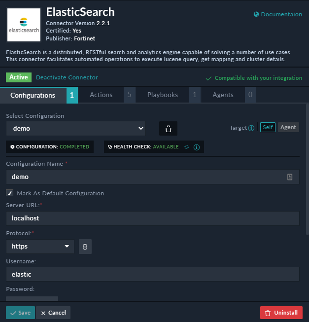
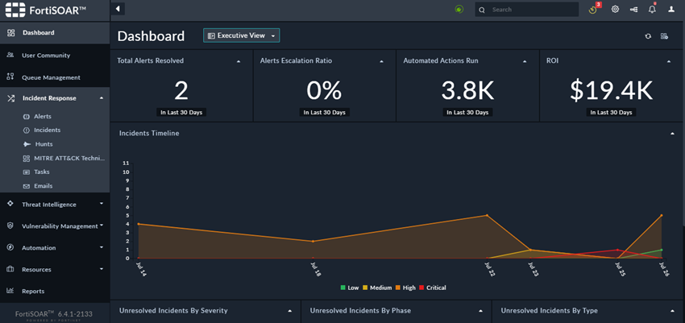
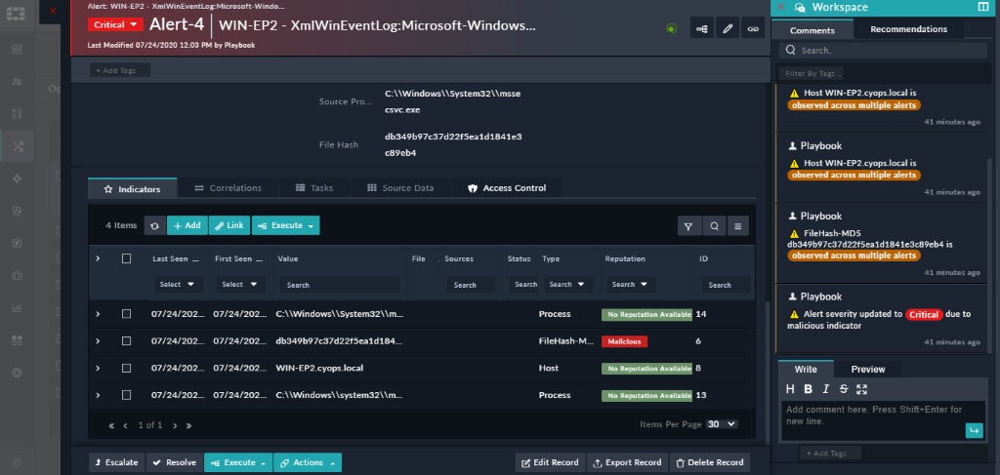
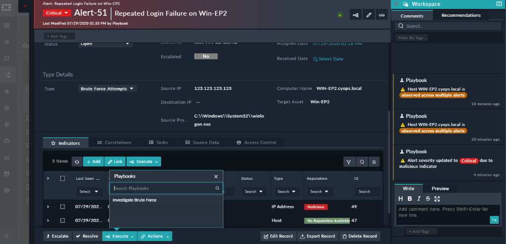
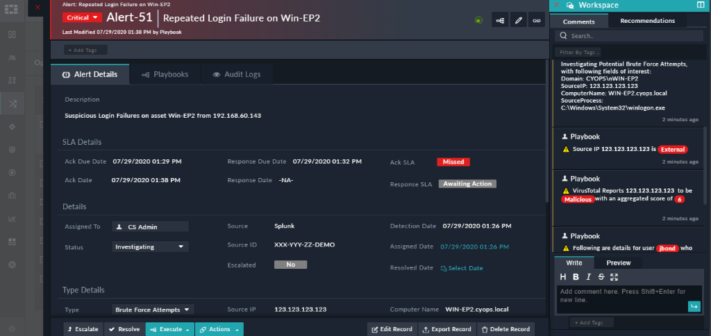
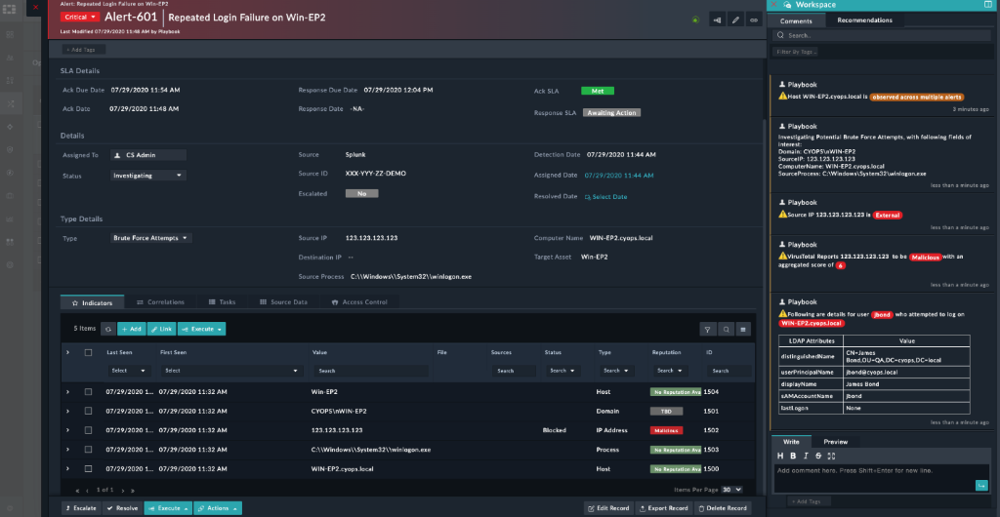
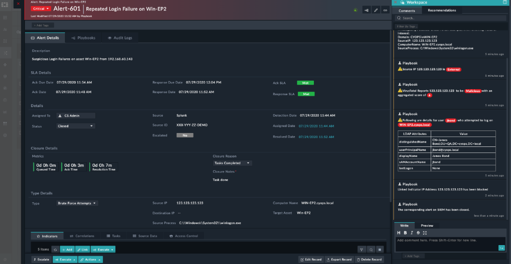
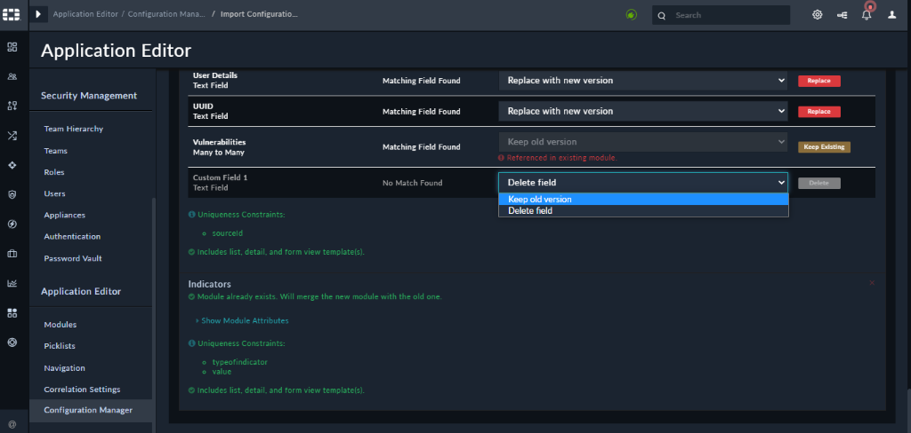

## Incident Response Solution Pack 7.0.2

This article describes the FortiSOAR™ Incident Response Solution Pack (FSR-IR-SOLUTION-PACK) enables users to experience the power of FortiSOAR™ incident response. FortiSOAR™ is built using modular architecture and the FSR IR Solution Pack is the implementation of best practices to configure and use FortiSOAR™ in an optimal manner. The FSR Solution Pack also contains a lot of sample/simulation/training data that enables you to experience FortiSOAR™ without having all the devices.

## Overview

This article covers the following:

- Deploying IR Solution Pack
- Configuring IR Solution Pack
- Contents of the IR Solution Pack
- Using IR Solution Pack
- Upgrading IR Solution Pack

## Deploying IR Solution Pack

**Important**: Before you deploy the solution pack, ensure that you have installed FortiSOAR™ and there are no records such as alerts, indicators, incidents, etc., in your FortiSOAR™ system.

Use the following procedure as a *root* user to deploy the solution pack:

1. Log onto the IR Solution Pack GIT repo (https://github.com/fortinet-fortisoar/solution-pack-incident-response) using your credentials.

2. Click the **Clone** button and select the **Download ZIP** option.
   

3. Log into your FortiSOAR instance, and on the left-navigation, click **Import Wizard**.
   

4. On the `Import Wizard` page, click **Import From File** and selected the solution pack zip that you have downloaded, and navigate through the Import Wizard.
   

   **Note**: It is recommended not the change any configurations or options of the imported solution pack zip file.
   Once the import is successfully completed, you can use the IR solution pack.

## Configuring IR Solution Pack

Before you begin using the solution pack, you should configure connectors such as AlienVault, VirusTotal, and IP Stack, so that you can experience the default enrichments of records using these connectors. To configure these connectors all you need to do is create accounts for all the above products; which can be created for free and do not necessarily require a corporate account. Once you have created your account, enter the account details, such as the Server URL and API Key, in the respective connector’s configuration page.

You should also configure the ElasticSearch, SSH, and FortiSOAR SOC Simulator connector.

### Configuring the ElasticSearch Connector

To configure this connector, open the ElasticSearch Connector and in its "Configuration Page" enter the following values for the configuration parameters: 

- **Configuration Name**: Provide a name for this configuration and you can optionally mark this configuration as the “Default Configuration”. 

- **Server URL**: localhost 

- **Protocol**: https 

- **Username**: elastic

- **Password**: Enter the Device UUID of your FortiSOAR™ instance 

- **Port**: 9200 

- Verify SSL: Ensure that this checkbox is cleared
  
### Configuring the SSH Connector

The SSH connector is used in the enrichment playbooks to find the hostname of an asset. To configure this connector, open the SSH Connector and in its "Configuration Page" enter the following values for the configuration parameters: 

- **Configuration Name**: Provide a name for this configuration and you can optionally mark this configuration as the “Default Configuration”. 
- **Host**: localhost 
- **Port**: 22 
- **Username**: csadmin
- **Password**: SSH password of the "csadmin" user.

### Configuring the FortiSOAR SOC Simulator Connector

The FortiSOAR SOC Simulator connector is used to create various scenarios. To configure this connector, open the FortiSOAR SOC Simulator Connector and in its "Configuration Page" enter the following values for the configuration parameters: 

- **Configuration Name**: Provide a name for this configuration and you can optionally mark this configuration as the “Default Configuration”. 
- **Import Scenarios**: Select this checkbox to import various scenarios. 
- **Load Threat Intelligence**: Whenever records are recreated for a scenario, they include known malicious indicators, such as IP addresses, file hash, etc. Selecting this checkbox randomly assigns the malicious indicators to records every time a record is created. Therefore, the records get created with new indicators each time.

Once you have configured the FortiSOAR SOC Simulator connector, sample scenarios get created in **Help** > **Scenario** and now, you are all set to start using the solution pack and creating demo records. 

## Contents of the IR Solution Pack

The solution pack consists of the following:

- Default Modules
- Collection of Playbooks
- Collection of Dashboards
- Collection of Roles

Once you log on to FortiSOAR™, the FortiSOAR™ UI appears as a collection of modules, as shown in the following image:

Each module, such as "Incidents" provide access to individual data models within the FortiSOAR™ database.

A brief about each module collection follows:

- **Dashboards**: Dashboards are generally the users' default home page. Administrators create dashboards that are applicable throughout the application and are assigned to users based on their roles.

- **User Community**: User community links to the FortiSOAR™ User Community page, which provides you with additional resources for FortiSOAR™, including forums, blogs, demos, use cases, etc.

- **Queue Management**: Queue Management provides you with an overview of work (records) that requires to be completed and enables you to assign pending work to users. You can also configure queue management to assign unassigned items to specific queues or users automatically. 

- **Incident Response**: The Incident Response section is a collection of all modules typically related to Security Incidents. You might work on the entire Incident lifecycle from within this module. This module underpins the operational side of your SOC. The standard flow starts within the Alerts module.

- - **Alerts**: Stores alerts that are ingested from SIEMs, Emails, and other configured data sources. The default schema of alerts is based on ElasticSearch Common Schema. You can add more fields as required.
  - **Incidents**: Stores incidents, which represent a collection of information discovered during an Incident Response investigation. Incidents are triggered based on the suspicion or confirmation of a security breach. Incidents can be cyber or physical security-related.Multiple alerts, indicators, and other artifacts can be linked to an incident.
  - **Hunts**: Stores hunt information.
  - **Tasks**: Stores Tasks, which represent a discrete action taken by either an individual or an automated response. Tasks might link to outside systems, such as ticketing systems, to track specific actions beyond that of your SOC team.
  - **Emails**: Stores emails, which can contain potentially malicious emails, such as phishing emails. Once an email is added to this module, FortiSOAR™ extracts, and stores the Email Headers for further investigation. FortiSOAR™ also creates an alert with a link to the email. 

- **Threat Intelligence**: The Threat Intelligence section is a collection of all modules typically related to intelligence that is collected from various threats. It contains the following modules:

- - **Indicators**: Indicators contain details of all the data that is collected from system log entries or files, which identify potentially malicious activity on a system or network. It contains records of identifiable information regarding a threat, such as an IP or URL. 
  - **Campaigns**: Campaigns represent a collection of Incidents that can be tied to a single Threat Actor. Seemingly disparate Incidents might actually be related attempts from a malicious attacker attempting to probe and gain access to your network.

- **Vulnerability Management**: The Vulnerability Management section is a collection of all modules typically related to vulnerabilities that exist in your system. It contains the following modules:

- - **Assets**: Assets represent a unique piece of hardware and any information known about that hardware, such as MAC address, hostname, or IP address. Assets preferably have a unique identifier. Assets typically are only stored within FortiSOAR™ as records related to Incidents, Alerts, or Vulnerabilities. Asset information may be pulled from a CMDB or other resource available with knowledge of the asset characteristics, such as an ARP table or DHCP records.
  - **Scans**: Scans contain the details of all the scans that you run on your systems. It contains records of a bulk scan from scanners.
  - **Vulnerabilities**: Vulnerabilities represent a collection of weaknesses in your systems that can lead to security concerns. You can configure vulnerability scans to run periodically on your network, creating an inventory of the vulnerabilities for your specific assets.
  - **Users**:  Users represent a list of users who could potentially cause harm to your systems.  

- **Automation**: The Automation section is a collection of all modules that you can use to automate your security operations. It contains the following modules:

- - **Connectors**: Connectors provide you the ability to retrieve data from custom sources and perform automated operations.
  - **Playbooks**: Playbooks in FortiSOAR™ allows you to automate your security processes across external systems while respecting the business process required for your organization to function.
  - **Rule Engine**: Rule Engine in FortiSOAR™ allows you to automate processes and build rules based on logic. This makes it easier for you to maintain changes in your data in the future since all the logic is laid out in rules.
  - **Schedules**: Schedules in FortiSOAR™ allows you to schedule playbooks to run at regular intervals. 
  - **SLAs**: SLA Templates and Case Management Playbooks (PBs) in FortiSOAR™ can be used to create an in-built SLA management for incidents and alerts. For information on how to define SLAs and create SLA templates, see the FortiSOAR™ Product Documentation. FortiSOAR™ also provides you with an SLA Calculator connector, which is used to calculate SLAs that you have defined. For more information on the SLA Calculator connector and supporting PBs, see the [SLA Calculator Connector](https://docs.fortinet.com/document/fortisoar/1.0.0/sla-calculator/63/sla-calculator-v1-0-0) document.

- **Resources**: The Resources section is a collection of all modules typically related to components stored in  FortiSOAR™ such as attachments and templates. It contains the following modules:

- - **Attachments**: Attachments represent files that are uploaded and stored in FortiSOAR™. You submit files that are available in the FortiSOAR™ Attachments module to 3rd-party tools to scan and analyze suspicious files and retrieve reports for the submitted samples.
  - **Email Templates**: Email Templates represent templates that are stored in FortiSOAR™ that you can use when you want to send emails from FortiSOAR™. It contains a set of standard templates included with FortiSOAR™. Standard templates include emails that are sent by FortiSOAR™ when a new user is added in FortiSOAR™ or an email that is sent to users when they forget their passwords and send a request to reset the FortiSOAR™ password.
  - **Employee Watchlist**: Employee Watchlist represents a list of employees whose activities you want to monitor.
  - **Sensitive Files**: Sensitive Files represents a list of files that you want to monitor.  

- **Reports**: Reports represent FortiSOAR™ Reports that you should use for your reporting purposes. You can easily create rich reports and dashboards in FortiSOAR™. You can also schedule reports, view historical reports and also search for text in the report PDF, which is in the text PDF format. 

- **Widget Library**: The Widget Library allows users to edit out-of-the-box (OOB) widgets and build new widgets for custom use cases. Users can use the widgets library to customize existing widgets or build new widgets as per their requirements

- **Help**: The Help module resources that help you effectively with FortiSOAR™. It contains Scenarios, which have been explained later in this document, the FortiSOAR™ product guides, knowledge center, and a FAQ section.

## Using IR Solution Pack

When you log on to your FortiSOAR™ instance you will notice that the instance does not contain any scenarios or demo records; you have to create the same by clicking **Incident Response** > **Alerts** in the left navigation and then clicking the **Demo IR Records** button. 

Once you click the **Demo IR Records** button, the following actions are performed: 

- Configuration of the Code Snippet connector. 
- Creation of Demo records, i.e. sample alerts with associated indicators, vulnerabilities, assets, etc. 
  The indicators of the demo records also get enriched, since the connectors are configured and described in the following section.

### Use case examples 

When you click an alert and view its Collaboration Panel, you will observe that the alert is enriched, its associated indicators such as its file hashes are extracted and their reputations are checked using the configured connectors. The severity of the alert is also changed to “Critical”, since the alert contains a malicious indicator:

You can further use cases based on your requirements by running playbooks that associated with alerts.  

For example, if you click on the Repeated Login Failure alert, you will observe that the alert is of type “Brute Force Attempts”, and you can click **Execute** > **Investigate Brute Force**, to run the associated playbook and further investigate the alert: 

As observed in the following image, running the playbook conducts further investigation on the alert such as, extracting the source IP address, getting the reputation of that IP address using the VirusTotal connector, getting details of the user who has attempted the brute force attack, etc.:  

You can perform additional actions now on the enriched alert, for example, blocking the user who attempted the brute force, or marking an indicator as malicious, block the malicious indicator, i.e., IP address. To block an IP address, go to the Indicators tab in the alert, click the indicator that you want to block and click **Execute** > **Block IP Address**: 

 A dialog displaying a text box is displayed, where you can specify the reason for blocking the IP address, such as “Found malicious during investigation” and click **Block**. 

To complete the block operation, click the indicator to open the indicator record, then click the **Pending items** icon, which displays the block dialog on which you can confirm the blocking of the indicator.

Now, you can see that a new task added which confirms that the linked IP address has been blocked:  

Once all the tasks on this alert are completed, you can close this alert by selecting “Closed” from the **Status** drop-down list in the alert, provide the reason for closing the alert, and click **Update**. You can also choose to close the alert on the SIEM:

Now, you can see that a new task added which confirms that the alert on the SIEM has closed, and it also shows metrics of queue time, time for acknowledging the alert and the time for resolving the investigation: 

### Scenarios 

Users can also use various scenarios to understand how FortiSOAR™ handles various scenarios. To view scenarios, click **Help** > **Scenario**. The Scenario page displays various scenarios, such as Data Leakage, Phishing Emails, etc. 

Some scenarios demonstrate particular features of FortiSOAR™, such as FortiSOAR™ recommendation engine which lists alerts containing similar hosts etc, providing you with a complete picture of the incident. Some scenarios demonstrate an investigation process and therefore contain associated investigation playbooks, etc.  

For example, in the Stolen Credentials scenario, click the down-arrow on the “Stolen credential leading to data exfiltration” row, and the description of this scenario is displayed: 

To run this scenario, select Stolen credential leading to data exfiltration and click **Run Scenario**. Clicking Run Scenario creates alerts and/or incidents corresponding to this scenario. Clicking an alert created by this scenario, for example, the “Windows User Created”, opens the alert and when you click on the Recommendations tab, you observe that many similar alerts have been created, giving you an idea that related operations are taking place, and therefore, the task of a SOC analyst to go through a number of alerts to figure out what is similar is solved by FortiSOAR™ Recommendation engine. Now, you can select all the similar alerts and link them and also escalate them to create a Security Incident. 

To view the source for the Stolen credential leading to data exfiltration scenario, click **Help** > **Scenario** > **Stolen credential leading to data exfiltration**. Then click on the **Source** tab, the “Steps” section, contains data used by playbooks to create the demo records. Once the alerts are created their IDs are listed in the “Created Alerts” section:

If you want to delete the records created by this scenario, you can click the **Reset Scenario** button on the “Scenario” page.  

You can also click the **Run Selected** **Scenario** to create a specific scenario from the “Alerts” page.  

### MITRE Attack Techniques 

MITRE Attack Technique Module allows you to download MITRE techniques from [MITRE.org](https://www.mitre.org/). These techniques are stored with FortiSOAR™ for reference. A default playbook to download MITRE techniques is shipped with a solution pack.

These techniques are auto-related to specific alerts based on MITRE techniques they match.   

**Note**: For MITRE tech correlation to work, the ‘MITRE ATT&CK ID’ field in alerts requires to be populated by the ingestion playbooks. These IDs can then be added to the alert / event generation rules in SIEM or another log aggregator.    

## Upgrading IR Solution Pack

If users have a solution pack installed, then the rpm will upgrade to a new version to be in sync with the base product. However, the contents of the solution pack will not be changed or upgraded. To update the contents, users can download the latest contents from the support portal, review the changes, and then manually update the contents. This is done to prevent overwriting changes that might be done by users.  

Before you proceed to upgrade the contents of the solution pack manually, you must take a backup of your current configuration using the “Configuration Manager”. You can export all the modules along with their MMDs, SVTs, and all the required playbooks.  

While importing MMDs/ SVTs using the configuration manager, you must take care that you do not delete any field that belongs to an existing module.    
For example, in the following image, when you are importing the “Alerts” module using the configuration manager, you must ensure that "Custom Field 1" and retained and not deleted:  

**Note**: SVT changes might get lost during import and therefore, you can restore them using the configuration that you have backed up.  

After you have imported the MMDs and SVTs, you can import the desired playbooks. 

**FortiSOAR IR Solution Pack: Out-of-the-box use cases & playbook collections list can be found [here](https://fusecommunity.fortinet.com/groups/community-home/digestviewer/viewthread?GroupId=1345&MessageKey=045e34e1-467a-4d91-a28c-152e1351f614&CommunityKey=9f1420e8-e3c6-4535-8cae-3fa714da66d8&tab=digestviewer&ReturnUrl=%2fgroups%2fcommunity-home%2fdigestviewer%3fcommunitykey%3d9f1420e8-e3c6-4535-8cae-3fa714da66d8%26tab%3ddigestviewer)**

